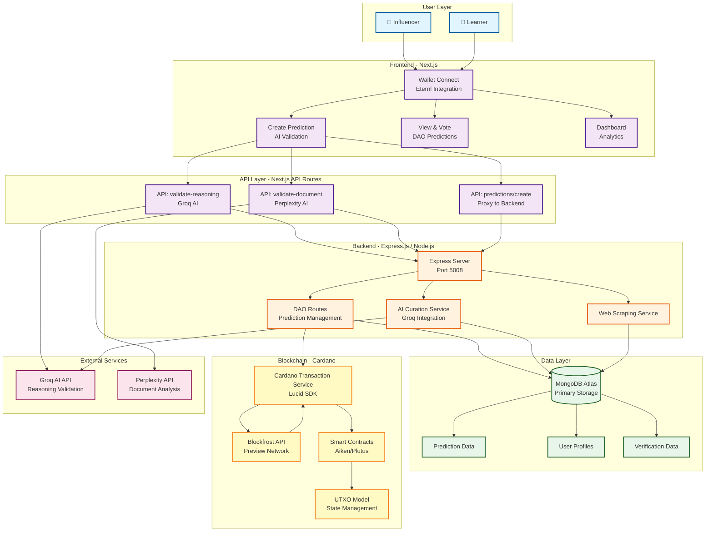
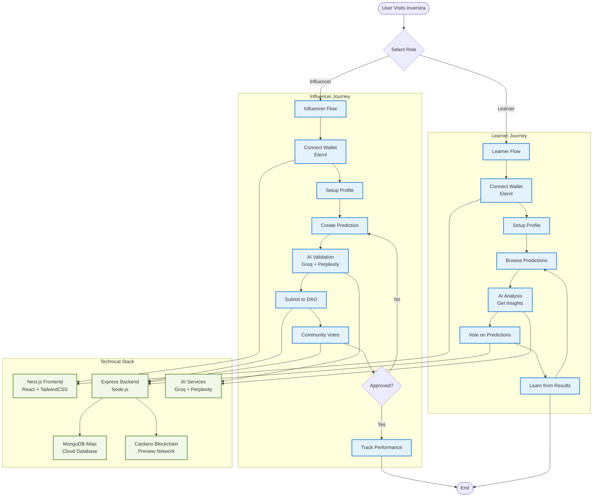
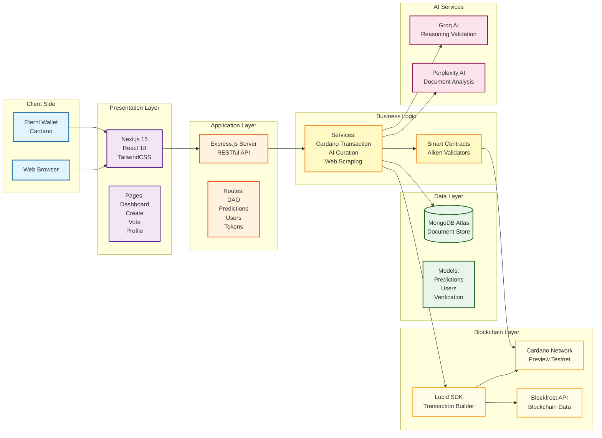
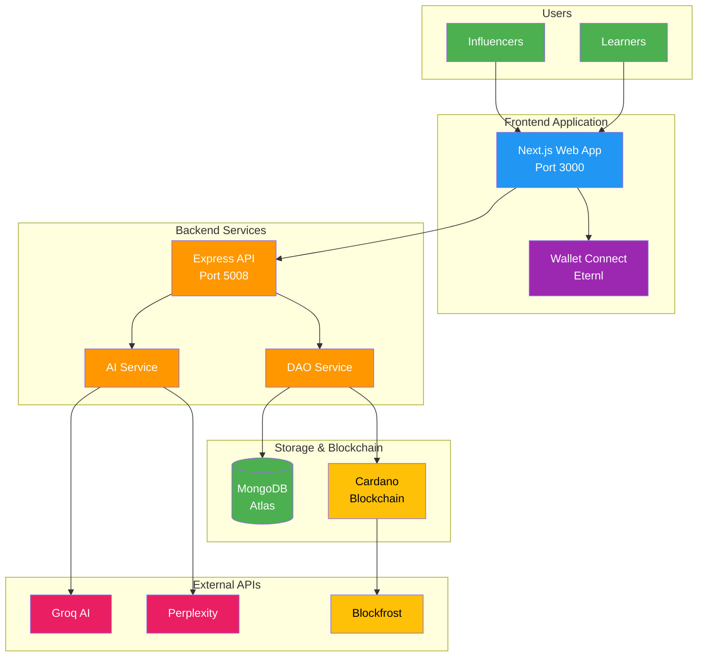

# Inverstra Platform Architecture Diagram

## Mermaid Flowchart Code

```mermaid
graph TB
    subgraph "User Layer"
        I[👤 Influencer]
        L[👤 Learner]
    end

    subgraph "Frontend - Next.js"
        WC[Wallet Connect<br/>Eternl Integration]
        CP[Create Prediction<br/>AI Validation]
        VP[View & Vote<br/>DAO Predictions]
        DH[Dashboard<br/>Analytics]
    end

    subgraph "API Layer - Next.js API Routes"
        API1[API: validate-reasoning<br/>Groq AI]
        API2[API: validate-document<br/>Perplexity AI]
        API3[API: predictions/create<br/>Proxy to Backend]
    end

    subgraph "Backend - Express.js / Node.js"
        BE[Express Server<br/>Port 5008]
        DAO[DAO Routes<br/>Prediction Management]
        AI[AI Curation Service<br/>Groq Integration]
        WS[Web Scraping Service]
    end

    subgraph "Data Layer"
        MDB[(MongoDB Atlas<br/>Primary Storage)]
        PD[Prediction Data]
        UP[User Profiles]
        VD[Verification Data]
    end

    subgraph "Blockchain - Cardano"
        CT[Cardano Transaction Service<br/>Lucid SDK]
        BF[Blockfrost API<br/>Preview Network]
        SC[Smart Contracts<br/>Aiken/Plutus]
        UTXO[UTXO Model<br/>State Management]
    end

    subgraph "External Services"
        GROQ[Groq AI API<br/>Reasoning Validation]
        PERP[Perplexity API<br/>Document Analysis]
    end

    %% User Flow
    I --> WC
    L --> WC
    WC --> CP
    WC --> VP
    WC --> DH

    %% Frontend to API
    CP --> API1
    CP --> API2
    CP --> API3

    %% API to Backend
    API1 --> BE
    API2 --> BE
    API3 --> BE

    %% Backend Processing
    BE --> DAO
    BE --> AI
    BE --> WS
    DAO --> CT

    %% Data Persistence
    DAO --> MDB
    AI --> MDB
    WS --> MDB
    MDB --> PD
    MDB --> UP
    MDB --> VD

    %% Blockchain Integration
    CT --> BF
    CT --> SC
    SC --> UTXO
    BF --> CT

    %% External AI Services
    API1 --> GROQ
    API2 --> PERP
    AI --> GROQ

    %% Styling
    classDef userClass fill:#e1f5ff,stroke:#01579b,stroke-width:2px
    classDef frontendClass fill:#f3e5f5,stroke:#4a148c,stroke-width:2px
    classDef backendClass fill:#fff3e0,stroke:#e65100,stroke-width:2px
    classDef dataClass fill:#e8f5e9,stroke:#1b5e20,stroke-width:2px
    classDef blockchainClass fill:#fff9c4,stroke:#f57f17,stroke-width:2px
    classDef externalClass fill:#fce4ec,stroke:#880e4f,stroke-width:2px

    class I,L userClass
    class WC,CP,VP,DH,API1,API2,API3 frontendClass
    class BE,DAO,AI,WS backendClass
    class MDB,PD,UP,VD dataClass
    class CT,BF,SC,UTXO blockchainClass
    class GROQ,PERP externalClass
```

## Detailed User Flow Diagram

```mermaid
flowchart TD
    Start([User Visits Inverstra]) --> Role{Select Role}
    
    Role -->|Influencer| IFlow[Influencer Flow]
    Role -->|Learner| LFlow[Learner Flow]
    
    subgraph "Influencer Journey"
        IFlow --> Connect1[Connect Wallet<br/>Eternl]
        Connect1 --> Profile1[Setup Profile]
        Profile1 --> Create[Create Prediction]
        Create --> Validate[AI Validation<br/>Groq + Perplexity]
        Validate --> Submit[Submit to DAO]
        Submit --> Vote1[Community Votes]
        Vote1 --> Result1{Approved?}
        Result1 -->|Yes| Track1[Track Performance]
        Result1 -->|No| Create
    end
    
    subgraph "Learner Journey"
        LFlow --> Connect2[Connect Wallet<br/>Eternl]
        Connect2 --> Profile2[Setup Profile]
        Profile2 --> Browse[Browse Predictions]
        Browse --> Analyze[AI Analysis<br/>Get Insights]
        Analyze --> Vote2[Vote on Predictions]
        Vote2 --> Learn[Learn from Results]
        Learn --> Browse
    end
    
    subgraph "Technical Stack"
        Frontend[Next.js Frontend<br/>React + TailwindCSS]
        Backend[Express Backend<br/>Node.js]
        Database[MongoDB Atlas<br/>Cloud Database]
        Blockchain[Cardano Blockchain<br/>Preview Network]
        AI[AI Services<br/>Groq + Perplexity]
    end
    
    Connect1 --> Frontend
    Connect2 --> Frontend
    Submit --> Backend
    Vote1 --> Backend
    Vote2 --> Backend
    Backend --> Database
    Backend --> Blockchain
    Validate --> AI
    Analyze --> AI
    
    Track1 --> End([End])
    Learn --> End
    
    classDef userFlow fill:#e3f2fd,stroke:#1976d2,stroke-width:2px
    classDef techStack fill:#f1f8e9,stroke:#558b2f,stroke-width:2px
    
    class IFlow,LFlow,Connect1,Connect2,Profile1,Profile2,Create,Validate,Submit,Vote1,Vote2,Browse,Analyze,Learn,Track1 userFlow
    class Frontend,Backend,Database,Blockchain,AI techStack
```

## System Architecture Overview

```mermaid
graph LR
    subgraph "Client Side"
        Browser[Web Browser]
        Wallet[Eternl Wallet<br/>Cardano]
    end
    
    subgraph "Presentation Layer"
        NextJS[Next.js 15<br/>React 18<br/>TailwindCSS]
        Pages[Pages:<br/>Dashboard<br/>Create<br/>Vote<br/>Profile]
    end
    
    subgraph "Application Layer"
        Express[Express.js Server<br/>RESTful API]
        Routes[Routes:<br/>DAO<br/>Predictions<br/>Users<br/>Tokens]
    end
    
    subgraph "Business Logic"
        Services[Services:<br/>Cardano Transaction<br/>AI Curation<br/>Web Scraping]
        Validators[Smart Contracts<br/>Aiken Validators]
    end
    
    subgraph "Data Layer"
        MongoDB[(MongoDB Atlas<br/>Document Store)]
        Models[Models:<br/>Predictions<br/>Users<br/>Verification]
    end
    
    subgraph "Blockchain Layer"
        Cardano[Cardano Network<br/>Preview Testnet]
        Lucid[Lucid SDK<br/>Transaction Builder]
        Blockfrost[Blockfrost API<br/>Blockchain Data]
    end
    
    subgraph "AI Services"
        Groq[Groq AI<br/>Reasoning Validation]
        Perplexity[Perplexity AI<br/>Document Analysis]
    end
    
    Browser --> NextJS
    Wallet --> NextJS
    NextJS --> Express
    Express --> Services
    Services --> MongoDB
    Services --> Lucid
    Lucid --> Cardano
    Lucid --> Blockfrost
    Services --> Groq
    Services --> Perplexity
    Services --> Validators
    Validators --> Cardano
    
    classDef client fill:#e1f5ff,stroke:#01579b,stroke-width:2px
    classDef presentation fill:#f3e5f5,stroke:#4a148c,stroke-width:2px
    classDef application fill:#fff3e0,stroke:#e65100,stroke-width:2px
    classDef business fill:#fff9c4,stroke:#f57f17,stroke-width:2px
    classDef data fill:#e8f5e9,stroke:#1b5e20,stroke-width:2px
    classDef blockchain fill:#fffde7,stroke:#f9a825,stroke-width:2px
    classDef ai fill:#fce4ec,stroke:#880e4f,stroke-width:2px
    
    class Browser,Wallet client
    class NextJS,Pages presentation
    class Express,Routes application
    class Services,Validators business
    class MongoDB,Models data
    class Cardano,Lucid,Blockfrost blockchain
    class Groq,Perplexity ai
```

## Simplified Architecture for PPT

```mermaid
graph TB
    subgraph "Users"
        U1[Influencers]
        U2[Learners]
    end
    
    subgraph "Frontend Application"
        FE[Next.js Web App<br/>Port 3000]
        WC[Wallet Connect<br/>Eternl]
    end
    
    subgraph "Backend Services"
        BE[Express API<br/>Port 5008]
        DAO[DAO Service]
        AI[AI Service]
    end
    
    subgraph "Storage & Blockchain"
        DB[(MongoDB<br/>Atlas)]
        BC[Cardano<br/>Blockchain]
    end
    
    subgraph "External APIs"
        GROQ[Groq AI]
        PERP[Perplexity]
        BF[Blockfrost]
    end
    
    U1 --> FE
    U2 --> FE
    FE --> WC
    FE --> BE
    BE --> DAO
    BE --> AI
    DAO --> DB
    DAO --> BC
    AI --> GROQ
    AI --> PERP
    BC --> BF
    
    style U1 fill:#4CAF50,color:#fff
    style U2 fill:#4CAF50,color:#fff
    style FE fill:#2196F3,color:#fff
    style WC fill:#9C27B0,color:#fff
    style BE fill:#FF9800,color:#fff
    style DAO fill:#FF9800,color:#fff
    style AI fill:#FF9800,color:#fff
    style DB fill:#4CAF50,color:#fff
    style BC fill:#FFC107,color:#000
    style GROQ fill:#E91E63,color:#fff
    style PERP fill:#E91E63,color:#fff
    style BF fill:#FFC107,color:#000
```

