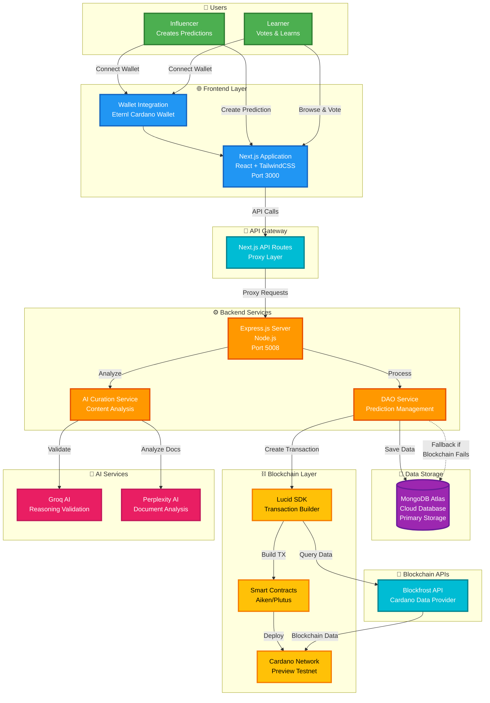
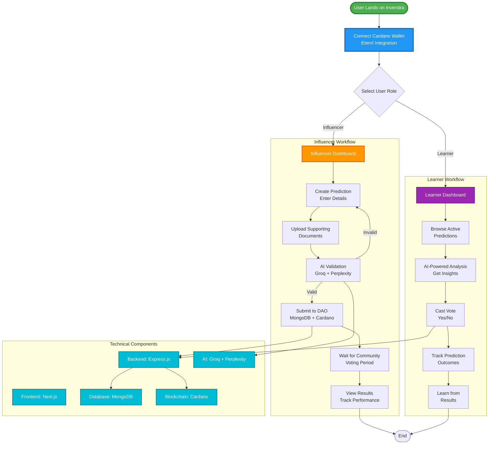
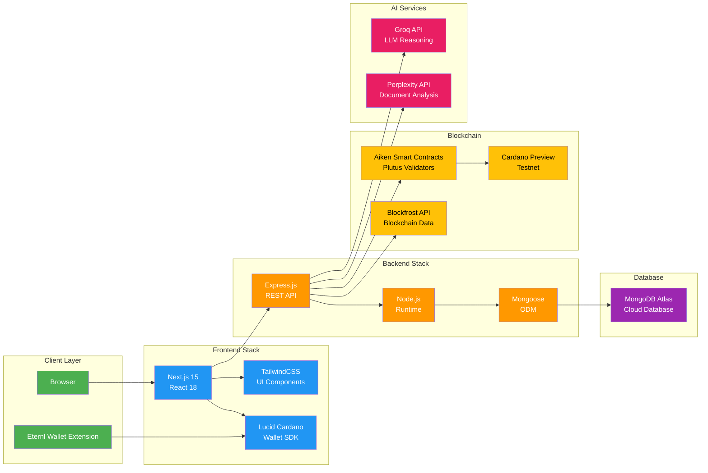

# Inverstra Architecture - PowerPoint Ready

## 🎯 Main Architecture Diagram (Recommended for PPT)

## 📊 Complete User Journey Flow

## 🏗️ System Architecture - Technical Stack

## 💡 How to Use in PowerPoint

1. **Copy the Mermaid code** from any diagram above
2. **Go to**: https://mermaid.live/ or use a Mermaid plugin in PowerPoint
3. **Paste the code** and render
4. **Export as PNG/SVG** for your presentation
5. **Or use**: VS Code with Mermaid extension to export directly

## 🎨 Color Scheme Used

- **Users**: Green (#4CAF50)
- **Frontend**: Blue (#2196F3)
- **Backend**: Orange (#FF9800)
- **Database**: Purple (#9C27B0)
- **Blockchain**: Yellow (#FFC107)
- **AI Services**: Pink (#E91E63)
- **APIs**: Cyan (#00BCD4)

